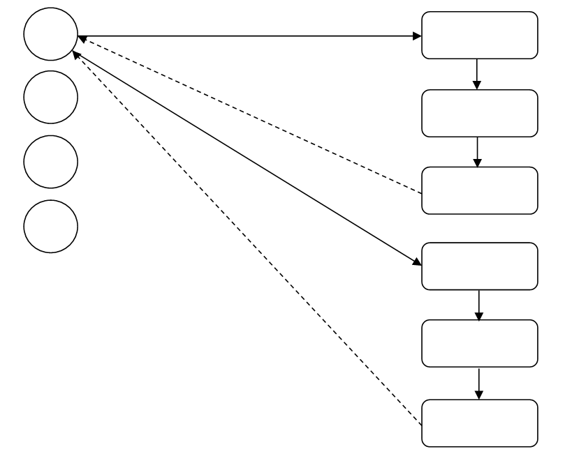
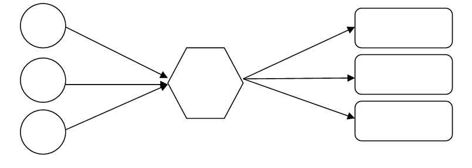

```{r child = "setup.Rmd"}
```

```{r xaringan-tile-view, echo=FALSE}
xaringanExtra::use_tile_view()
```

```{r xaringan-editable, echo=FALSE}
xaringanExtra::use_editable(expires = 1)
```

```{r xaringan-panelset, echo=FALSE, message=FALSE, warning=FALSE}
xaringanExtra::use_panelset()
xaringanExtra::style_panelset_tabs(panel_tab_font_family = "sans-serif")
```

```{r xaringanExtra-clipboard, echo=FALSE}
htmltools::tagList(
  xaringanExtra::use_clipboard(
    button_text = "<i class=\"fa fa-clipboard\"></i>",
    success_text = "<i class=\"fa fa-check\" style=\"color: #90BE6D\"></i>",
    error_text = "<i class=\"fa fa-times-circle\" style=\"color: #F94144\"></i>"
  ),
  rmarkdown::html_dependency_font_awesome()
)
```

```{r xaringan-fit-screen, echo=FALSE}
xaringanExtra::use_fit_screen()
```

```{r xaringan-extra-styles, echo=FALSE}
xaringanExtra::use_extra_styles(
  hover_code_line = TRUE,         #<<
  mute_unhighlighted_code = TRUE  #<<
)
```

```{css include=FALSE}
.panelset {
   --panel-tab-foreground: currentColor;
   --panel-tab-background: unset;
   --panel-tab-active-foreground: currentColor;
   --panel-tab-active-background: unset;
   --panel-tab-active-border-color: currentColor;
   --panel-tab-hover-foreground: currentColor;
   --panel-tab-hover-background: unset;
   --panel-tab-hover-border-color: currentColor;
   --panel-tab-inactive-opacity: 0.5;
   --panel-tabs-border-bottom: #ddd;
   --panel-tab-font-family: Sen;
   --panel-tab-background-color-active: #fffbe0;
   --panel-tab-border-color-active: #023d4d;
}

.panelset .panel-tabs .panel-tab > a {
	color: #023d4d;
}

.panelset .panel-tabs {
  font-size: 0.5rem;
}
```

class: center, middle

## Retrospecto

---

## Definições

### Logística

.midi[
.question[
“**Logística** é dispor a **mercadoria ou o serviço** certo, no **lugar** certo, no **tempo** certo e nas **condições desejadas**, ao mesmo tempo em que fornece a **maior contribuição à empresa**”. 
(Ballou, 2001)
]
]

### Gestão Cadeia de Suprimentos

.question[
.midi[
**Cadeia de suprimentos** é a estrutura consolidada e integrada, em níveis estratégico, tático e operacional, entre agentes de produção, mercadológicos, logísticos e sociedade, para que seja possível coordenar as operações de maneira a garantir a gestão orientada à logística, tendo como objetivo o _trade-off_ entre **responsividade** e **eficiência**, além de garantia de um contexto sustentável de desenvolvimento por ações **socialmente responsáveis** e **resilientes.** 
]
]

---

## Fatores-chave de desempenho

- **Instalações**   
- ~~Estoques~~   
- ~~Transportes~~   
- **Informação**   

---
class: inverse, middle

# Redes Logísticas

---

## Redes Logísticas

O projeto da rede de transporte é fator decisivo para garantir responsividade e custo competitivo na cadeia de suprimentos. 

### Rede de entrega direta
Todas as entregas acontecem diretamente do fornecedor para o varejista. Neste caso, a rota de cada carregamento é pré-determinada, sendo necessário definir apenas o volume a ser transportado e o meio de transporte mais eficiente. 

Vantagens:
- eliminação de intermediários logísticos, como atacadistas ou centros de distribuição;   
- simplicidade de operação e coordenação;   
- decisão sobre embarque é local;   
- baixa interferência entre fluxos;   
- tempo de transporte do fornecedor até ao ponto de varejo é reduzido.   

São aconselháveis quando o tamanho das lojas varejistas for suficientemente grande para justificar lotes de suprimentos ótimos próximos à carga cheia proveniente de cada fornecedor. 

Desvantagens:
- no caso de lojas pequenas, a rede de entrega direta é onerosa;   
- geraria um elevado custo de estoque na cadeia de suprimentos;   
- os custos de recebimento são altos porque cada fornecedor deve fazer uma entrega separada.    

```{r}
knitr::include_graphics("img/rede1.png")
```


---

```{r}

```


---
3.2	Entrega direta com milk run (coletas programadas)
Milk Run é um tipo de transporte para entrega e coleta de produtos em que um caminhão pode tanto entregar ou coletar um produto partindo de um único fornecedor para diversos varejistas ou de diversos fornecedores para entregar para apenas um varejista, respectivamente.

```{r}
knitr::include_graphics("img/rede3.png")
```
---


Vantagens:
	Eliminação de depósitos intermediários
	Redução dos custos de transporte por consolida as entregas a diversas lojas em um único caminhão. 


---

## Todas as entregas via centro de distribuição centralizado
```{r}

```

---

```{r}
knitr::include_graphics("img/rede5.png")
```


---

```{r}
knitr::include_graphics("img/rede6.png")
```


---

## Atividades da semana

Prazo | Atividade
------|----------
04/08/2021|[**Estudos Autônomos** - Logistica Urbana](https://retaoliveira.github.io/places/courses/log/est_3/)
11/08/2021|[**Estudos Autônomos** - Transportes](https://retaoliveira.github.io/places/courses/log/est_4/)
11/08/2021|[**Estudos Autônomos** - Gestão de Estoques](https://retaoliveira.github.io/places/courses/log/est_5/)
31/08/2021|[Projeto Final](https://retaoliveira.github.io/places/courses/log/project/)
---

class: center, middle

.larger[
**DÚVIDAS?**
]
