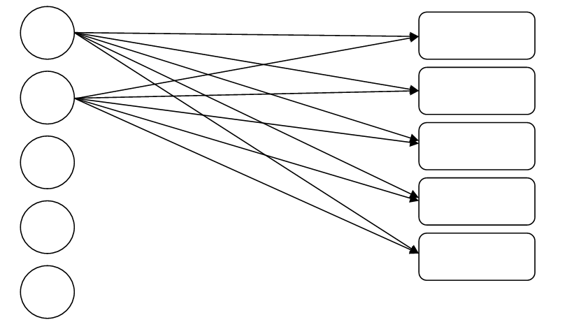
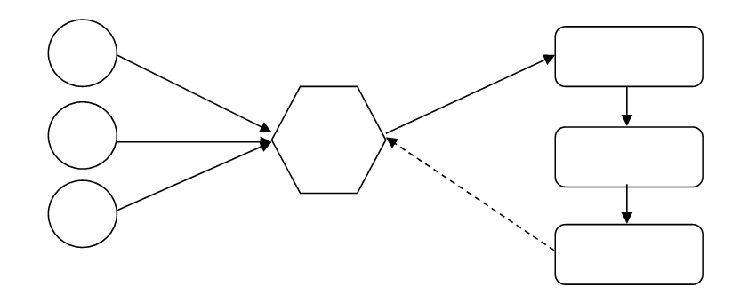

```{r child = "setup.Rmd"}
```

```{r xaringan-tile-view, echo=FALSE}
xaringanExtra::use_tile_view()
```

```{r xaringan-editable, echo=FALSE}
xaringanExtra::use_editable(expires = 1)
```

```{r xaringan-panelset, echo=FALSE, message=FALSE, warning=FALSE}
xaringanExtra::use_panelset()
xaringanExtra::style_panelset_tabs(panel_tab_font_family = "sans-serif")
```

```{r xaringanExtra-clipboard, echo=FALSE}
htmltools::tagList(
  xaringanExtra::use_clipboard(
    button_text = "<i class=\"fa fa-clipboard\"></i>",
    success_text = "<i class=\"fa fa-check\" style=\"color: #90BE6D\"></i>",
    error_text = "<i class=\"fa fa-times-circle\" style=\"color: #F94144\"></i>"
  ),
  rmarkdown::html_dependency_font_awesome()
)
```

```{r xaringan-fit-screen, echo=FALSE}
xaringanExtra::use_fit_screen()
```

```{r xaringan-extra-styles, echo=FALSE}
xaringanExtra::use_extra_styles(
  hover_code_line = TRUE,         #<<
  mute_unhighlighted_code = TRUE  #<<
)
```

```{css include=FALSE}
.panelset {
   --panel-tab-foreground: currentColor;
   --panel-tab-background: unset;
   --panel-tab-active-foreground: currentColor;
   --panel-tab-active-background: unset;
   --panel-tab-active-border-color: currentColor;
   --panel-tab-hover-foreground: currentColor;
   --panel-tab-hover-background: unset;
   --panel-tab-hover-border-color: currentColor;
   --panel-tab-inactive-opacity: 0.5;
   --panel-tabs-border-bottom: #ddd;
   --panel-tab-font-family: Sen;
   --panel-tab-background-color-active: #fffbe0;
   --panel-tab-border-color-active: #023d4d;
}

.panelset .panel-tabs .panel-tab > a {
	color: #023d4d;
}

.panelset .panel-tabs {
  font-size: 0.5rem;
}
```

class: center, middle

## Retrospecto

---

## Definições

### Logística

.midi[
.question[
“**Logística** é dispor a **mercadoria ou o serviço** certo, no **lugar** certo, no **tempo** certo e nas **condições desejadas**, ao mesmo tempo em que fornece a **maior contribuição à empresa**”. 
(Ballou, 2001)
]
]

### Gestão Cadeia de Suprimentos

.question[
.midi[
**Cadeia de suprimentos** é a estrutura consolidada e integrada, em níveis estratégico, tático e operacional, entre agentes de produção, mercadológicos, logísticos e sociedade, para que seja possível coordenar as operações de maneira a garantir a gestão orientada à logística, tendo como objetivo o _trade-off_ entre **responsividade** e **eficiência**, além de garantia de um contexto sustentável de desenvolvimento por ações **socialmente responsáveis** e **resilientes.** 
]
]

---

## Fatores-chave de desempenho

- **Instalações**   
- ~~Estoques~~   
- ~~Transportes~~   
- **Informação**   

---
class: inverse, middle

# Redes Logísticas

---

## FATORES QUE INFLUENCIAM AS DECISÕES DE REDE

.pull-left[
### Sob a ótica do transportador
- Custo relacionado ao veículo
- Custo operacional fixo
- Custo relacionado à viagem
- Custo relacionado à quantidade
- Custo indireto
]

.pull-right[
### Sob a ótica do embarcador
- Custo de transporte
- Custo de estoque
- Custo de instalação
- Custo de processamento
- Custo do nível de serviço
]

.tip[
O projeto da rede logística é fator decisivo para garantir responsividade e eficiência na cadeia de suprimentos. 
]
---

# Tipos de redes logísticas

## Rede de entrega direta
.question[
Todas as entregas acontecem diretamente do fornecedor para o varejista. Neste caso, a rota de cada carregamento é pré-determinada, sendo necessário definir apenas o volume a ser transportado e o meio de transporte mais eficiente. 
]

---

# Tipos de redes logísticas

## Rede de entrega direta

.pull-left[
.midi[
**Vantagens:**
- eliminação de intermediários logísticos, como atacadistas ou centros de distribuição;   
- simplicidade de operação e coordenação;   
- decisão sobre embarque é local;   
- baixa interferência entre fluxos;   
- tempo de transporte do fornecedor até ao ponto de varejo é reduzido.   

]]

.pull-right[
.midi[
**Desvantagens:**
- no caso de lojas pequenas, a rede de entrega direta é onerosa;   
- geraria um elevado custo de estoque na cadeia de suprimentos;   
- os custos de recebimento são altos porque cada fornecedor deve fazer uma entrega separada.    
]]

.tip[
.midi[
São aconselháveis quando o tamanho das lojas varejistas for suficientemente grande para justificar lotes de suprimentos ótimos próximos à carga cheia proveniente de cada fornecedor. 
]]

---

# Tipos de redes logísticas

## Rede de entrega direta

```{r echo=FALSE, message=FALSE, warning=FALSE}

```


---

# Tipos de redes logísticas

## Entrega direta com milk run (coletas programadas)

.question[
Milk Run é um tipo de transporte para entrega e coleta de produtos em que um caminhão pode tanto entregar ou coletar um produto partindo de um único fornecedor para diversos varejistas ou de diversos fornecedores para entregar para apenas um varejista, respectivamente.
]

**Vantagens:**
- Eliminação de depósitos intermediários
- Redução dos custos de transporte por consolida as entregas a diversas lojas em um único caminhão. 

---

# Tipos de redes logísticas

## Entrega direta com milk run (coletas programadas)

.pull-left[
```{r echo=FALSE, message=FALSE, warning=FALSE}

```
]

.pull-right[
```{r echo=FALSE, message=FALSE, warning=FALSE}
knitr::include_graphics("img/rede3.png")
```

]


---

# Tipos de redes logísticas

## Todas as entregas via centro de distribuição centralizado

.question[
A cadeia varejista distribui as lojas por localização geográfica e um CD é designado para atendimento destas lojas. Os fornecedores enviam as entregas para o CD e de lá as mercadorias são encaminhadas para as lojas. 
]

.midi[
- O CD pode desempenhar dois papéis diferentes, a saber: (i) **armazenar estoque**; (ii) **local de transferência**. 

- Os CDs auxiliam na redução dos custos da cadeia de suprimentos quando os fornecedores estão longe dos varejistas e os custos de transporte são altos, por meio de economias de escala. 

- O CD pode fazer apenas crossdocking, quando os lotes destinados às lojas servidas pelos CDs forem grandes o suficiente para atingir economias de escalas obtidas no ressuprimento de entrada. 
]

---

# Tipos de redes logísticas

## Todas as entregas via centro de distribuição centralizado

.question[
Crosdocking é o processo no qual chegam caminhões de diversos fornecedores, cuja carga é desmembrada em caminhões para diversos varejistas em carregamentos menores. 
]


```{r echo=FALSE, message=FALSE, warning=FALSE}
knitr::include_graphics("img/rede4.png")
```


---

# Tipos de redes logísticas


##	Entregas via centro de distribuição utilizando milk run

.question[
As entregas são realizadas a partir de um CD utilizando-se milk run quando os lotes a serem entregues em cada varejista forem pequenos, visando reduzir os custos com transportes por meio da consolidação. 
]


```{r echo=FALSE, message=FALSE, warning=FALSE}

```


---

# Tipos de redes logísticas


##	Rede sob medida
.question[
O transporte mescla crosdocking, milk run, transportadoras truck load, less than truck load e carga expressa. 
]

---

## Vantagens e Desvantagens das diferentes redes de transporte

.small[
Estrutura de Rede	|Vantagens|	Desvantagens
----------------| ----------| -------------
Entrega direta|Não possui depósito intermediário <br/>	Fácil de coordenar	|Grandes estoques <br/>	Despesa significativa com recebimento
Entrega direta com milk runs|	Redução dos custos de transporte para lotes pequenos <br/>		Redução dos estoques	|	Coordenação mais complexa
Todas as entregas via CD com armazenagem|	Redução dos custos de entrada do transporte por meio de consolidação| Maior custo de estoque <br/>	Mais manuseio no CD
Todas entregas via CD com crossdocking|	Pouquíssima necessidade de estoques <br/>	Redução no custo de transporte devido à consolidação | Coordenação mais complexa
Entregas via CD com milk runs|	Redução no custo de saída do transporte para pequenos lotes	| Coordenação ainda mais complexa
Rede sob medida	| Escolha do transporte mais adequado às necessidades individuais do produto ou da loja	| Coordenação muitíssimo complexa
]


---

## TRADE-OFFS NO PROJETO DE TRANSPORTE

**Trade-off entre o custo de transporte e responsividade ao cliente**

**Trade-off entre custos de transporte e estoque**

---

## TRADE-OFFS NO PROJETO DE TRANSPORTE

**Trade-off entre o custo de transporte e responsividade ao cliente**

.midi[
Se a empresa possui elevada responsividade (prazos de entrega enxutos, elevada confiabilidade), as entregas são muito fracionadas, implicando em elevados custos de transporte. 

Se a empresa entrega de forma mais consolidada, abrindo mão da elevada responsividade, os custos de transporte diminuem por conta da economia de escala. 

.tip[
A agregação temporária da demanda por ser interessante, levando à redução dos custos de transporte, pois implica em lotes de entrega mais consolidados, além de reduzir a variação do tamanho das entregas de um embarque a outro. Entretanto, essa estratégia prejudica o tempo de resposta ao cliente. A vantagem da agregação temporária diminui à medida que o intervalo de tempo no qual a agregação acontece é prolongado. 
]]

---

## TRADE-OFFS NO PROJETO DE TRANSPORTE

## Trade-off entre custos de transporte e estoque

.tip[
Duas decisões fundamentais que fomentam esta troca:    
(i) escolha do meio de transporte; e      
(ii) agregação de estoque.    
]


---

## Trade-off entre custos de transporte e estoque

**Escolha de Transporte**   

.midi[
A escolha de transporte é uma decisão de **projeto** (empresa a ser contratada) e de **operação** (meio de transporte) em uma cadeia de suprimento. 

**Meios de transporte** mais baratos normalmente acarretam em **maiores lotes de ressuprimentos** e em **lead times** mais longos, resultando em **maiores níveis de estoque na cadeia de suprimentos**. Modos que permitem **lotes menores**, gerando **níveis de estoque mais econômicos**, possuem **custos de contratação mais elevados**. 
]

.tip[

Ao selecionar um modo de transporte, os gerentes devem considerar os custos de estoque. Modos muito onerosos podem ser justificados se analisados de forma holística sob a ótica da cadeia de suprimentos. 
]

---

## Trade-off entre custos de transporte e estoque


**Agregação de estoques**

.midi[
As empresas podem **reduzir** significativamente o **estoque de segurança** **agregando** os estoques fisicamente em uma localidade. Entretanto, nesta situação, **os custos de transporte aumentam**. 

Para determinar o **nível de agregação de estoque**, as empresas devem considerar o trade-off entre custos de transporte, estoque e instalações. 

A **agregação de estoques** é aconselhável quando os **custos de estoque e instalações** representam uma parcela significativa dos **custos da cadeia de suprimentos**. Isto é, empresas com predominância de produtos com alta relação valor/peso e forte incerteza com relação à demanda. 

.tip[
As decisões sobre a agregação de estoque devem considerar custos de transporte e estoque. A agregação é vantajosa quando os produtos possuírem alta relação valor/peso, alta incerteza de demanda e se os pedidos dos clientes forem grandes.
]]

---

## Custos em Logística

### 1.3 Fatores que Influenciam nos Custos   


— **Quilometragem Desenvolvida**: O custo por quilômetro diminui quanto mais o veículo rodar, pois o custo fixo é dividido pela quilometragem. Há, contudo, que se observar o uso da velocidade econômica de operação do veículo, pois o aumento da velocidade pode influenciar no consumo de combustível, de pneus e de manutenção, tirando a vantagem obtida com a nova quilometragem.   

— **Tipo de Tráfego**: É sabido que na cidade o veículo gasta mais combustível por quilômetro rodado e tem um desgaste maior do que em áreas não urbanas.   

— **Tipo de Via**: O custo varia também em função do tipo de estrada por onde o ônibus ou o caminhão trafegar. Isto engloba superfície de rolamento, condição de conservação, topografia, sinuosidade etc.    


---

## Custos em Logística

### 1.3 Fatores que Influenciam nos Custos   

— **Região**: Conforme o lugar onde a transportadora atua, os salários, impostos, preços de combustível etc. podem ser diferentes.   

— **Porte do Veículo**: Um fator de redução do custo por tonelada/quilômetro ou passageiro/quilômetro transportado é a maior capacidade do veículo, desde que bem aproveitada.   

— **Desequilíbrio nos Fluxos**: Outro fator de variação nos custos é o desequilíbrio nos fluxos. No caso do transporte de passageiros, eles costumam ser pendulares (quem vai volta), o que geralmente não ocorre para as cargas.   


---

# Revisão da distribuição de pontos

Pontos|	Entrega|	Atividade
------|--------|-----------
20|	10/07	| Projeto incremental 1
10| 08/06 | Estudos Autônomos 1 - Nivel de serviço logístico
10| 29/06 | Estudos Autônomos 2 - KPIs
10| 29/06 | Estudos Autônomos 3 - Logística Urbana
10| 06/07 | Estudos Autônomos 4 - Gestão de Transportes
10| 01/09 | Estudos Autônomos 5 - Gestão de estoques e armazenagem
10| 08/09 | Estudos Autônomos 6 - Redes Logísticas e Custo
10| 08/09 | Estudos Autônomos 7 - Logística Sustentável, Multivarejo e Omnichannel
10| | Engajamento
TOTAL:| |	100 pontos

---

## Atividades da semana

Prazo | Atividade
------|----------
01/09/2021|[**Estudos Autônomos** - Gestão de Estoques](https://retaoliveira.github.io/places/courses/log/est_5/)
08/09/2021|[**Estudos Autônomos** - Redes Logísticas](https://retaoliveira.github.io/places/courses/log/est_6/)
08/09/2021|[**Estudos Autônomos** - Logística sustentável, Multivarejo e Omnichannel](https://retaoliveira.github.io/places/courses/log/est_7/)
---

class: center, middle

.larger[
**DÚVIDAS?**
]
